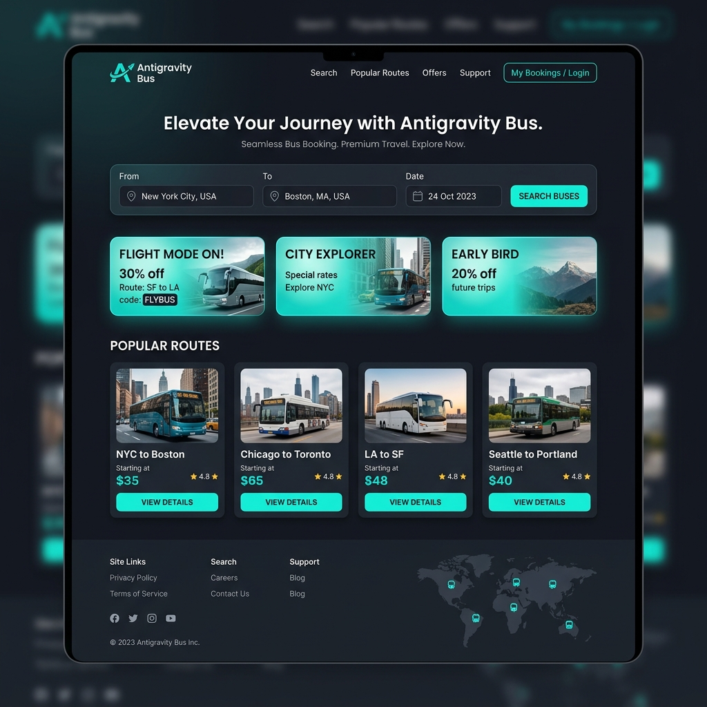
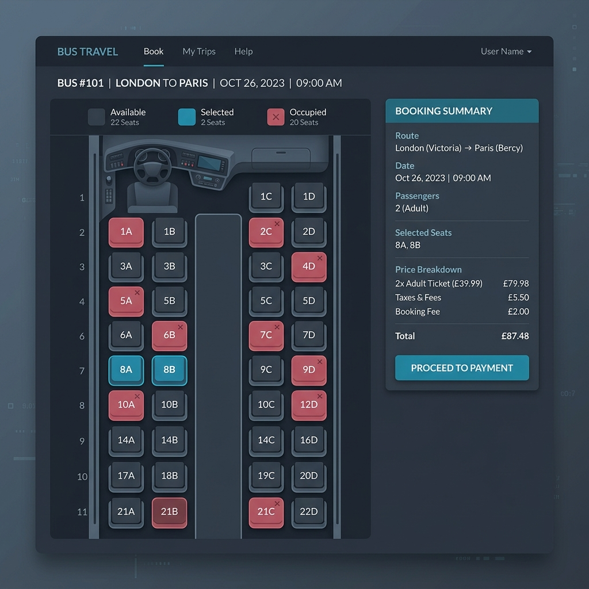
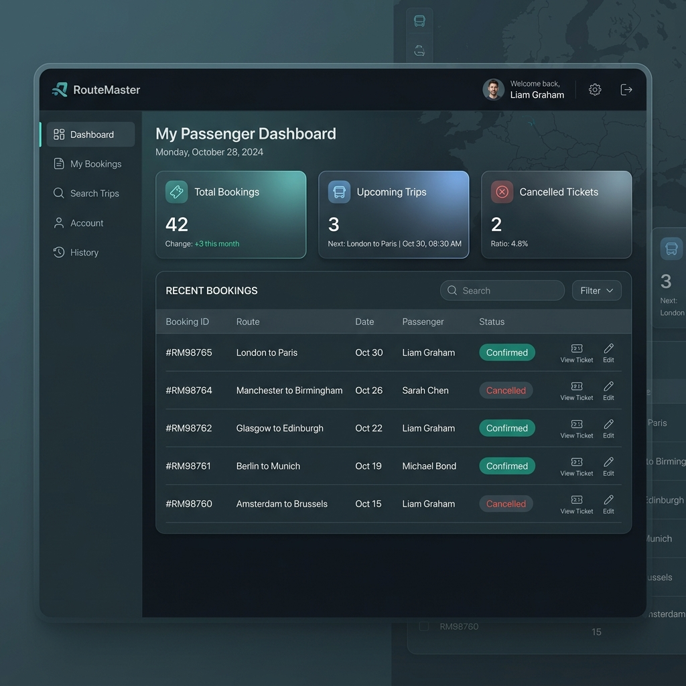

# Bus Ticket Booking Application

A responsive, high-performance web application designed for booking bus tickets. This project features a backend built on Django REST APIs (using function-based views and an SQLite database with raw SQL CRUD operations) and a frontend styled with a premium, slate-teal dark layout built on HTML5, CSS3, and JavaScript (ES6).

---

## 📸 Project Interface Mockups

### Homepage & Search Panel


### Interactive Seat Selection


### Passenger Stats Dashboard


---

## ✨ Features & Modules

### 1. Passenger Management
- Secure passenger registration (`POST /passengers/add/`) and login session management.
- Dynamic profile editing capabilities via `PUT /passengers/update/<id>/`.

### 2. Bus & Route Management
- Admin control panel to create, read, update, and delete bus services and scheduling routes.
- Advanced bus search engine filtering by price range, bus types (AC/Non-AC Sleeper, Seater, Luxury), and departure timing slots.

### 3. Ticket Booking & Payments
- Interactive bus cabin seat layout (2+2 structure with walkway aisle).
- Dynamically calculates ticket fares on selection. Capped at 6 tickets per booking.
- Integrated payment gateway simulating QR/UPI, Cards, and Digital Wallet checkout.

### 4. Booking Cancellation & Refund Status
- Cancel active bookings directly from the passenger history log.
- Triggers database updates changing booking status to `Cancelled` and payment status to `Refunded`.

### 5. Ticket PDF Download
- Generates high-fidelity digital tickets (boarding passes) with mock barcodes, passenger data, and seat allocation using `jsPDF` for instant download.

---

## 🛠️ Technology Stack

- **Frontend**: HTML5, CSS3 (Slate-Teal Dark theme with custom micro-animations), JavaScript (ES6), Fetch API, jsPDF
- **Backend**: Django, Python standard `sqlite3` library (Raw SQL Connection Helpers), Function-Based Views (FBV)
- **Database**: SQLite (initialized and pre-seeded automatically on startup)

---

## 🚀 Setup & Execution Guide

### Prerequisite
Ensure Python (version 3.8+) is installed on your local environment.

### 1. Run the Django Server
1. Navigate to the project root folder:
   ```bash
   cd "Full Stack MAJOR Project 17/BusTicketBooking"
   ```
2. Launch the Django server:
   ```bash
   python manage.py runserver
   ```
   *The server will run on `http://127.0.0.1:8000/` and automatically initialize the SQLite database (`db.sqlite3`) and seed sample test records.*

### 2. Run the Frontend App
To run the frontend, you can either:
- Open `Frontend/index.html` directly in your browser.
- Or launch a local HTTP server from the `BusTicketBooking` directory to simulate a production build:
  ```bash
  python -m http.server 3000 --directory Frontend
  ```
  Then access the application at `http://localhost:3000/`.

---

## 🔑 Test Credentials

Use these preloaded credentials to explore the features:

- **Passenger Session**:
  - Email: `rahul@gmail.com`
  - Password: `rahul123`
- **Admin / Operator Panel**:
  - Email: `admin@bus.com`
  - Password: `admin123`
