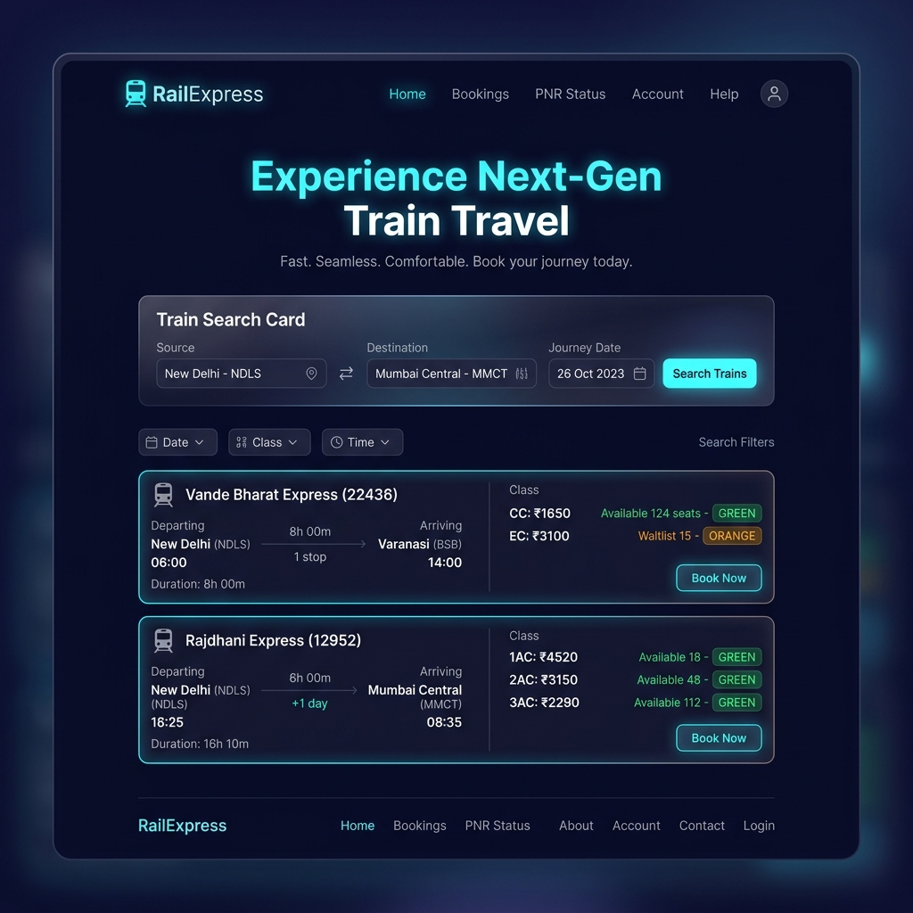
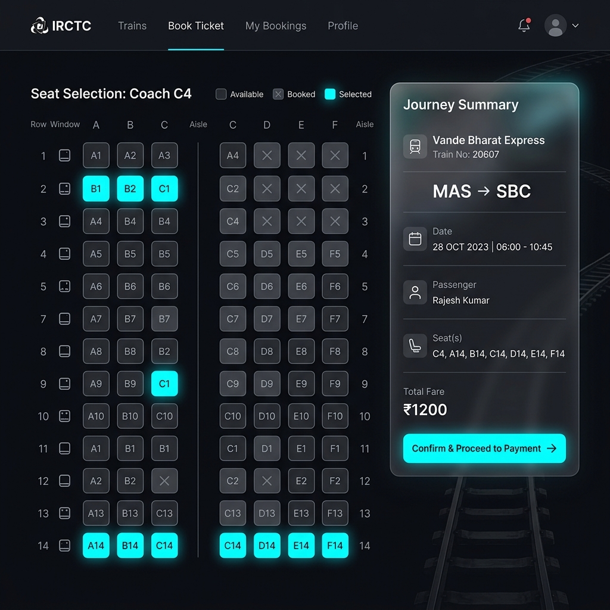
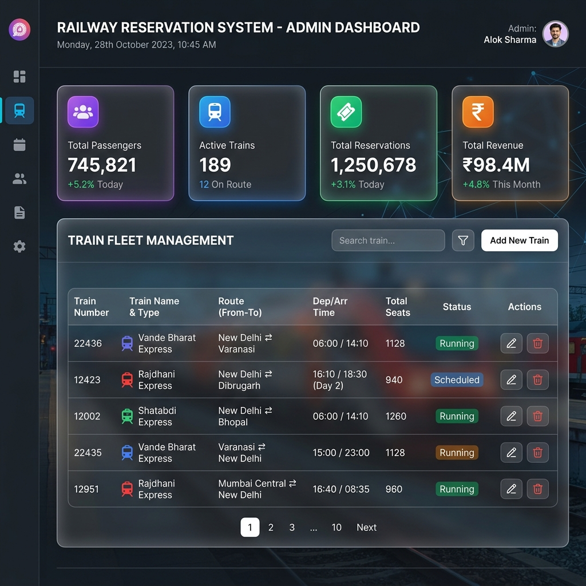

# 🚆 Railway Reservation System (RailExpress)

A full-stack Railway Reservation System application built with a **Django REST API** backend (using Function-Based Views and SQLite) and a modern **HTML5 / CSS3 / JavaScript** frontend integrated via the **Fetch API**.

---

## 🎨 User Interface Showcase

### 1. Home Page & Train Search


### 2. Ticket Reservation & Interactive Seat Selection


### 3. Railway Administrator Console


---

## 📁 Directory Structure

```
RailwayReservationSystem/
│
├── Backend/
│   ├── manage.py           # Django administrative script
│   ├── db.py               # SQLite helper & database connection utilities
│   ├── models.py           # Django models (Passenger, Train, Schedule, Booking, Payment)
│   ├── views.py            # Function-Based View API handlers (20 CRUD endpoints)
│   ├── urls.py             # URL routing for all API endpoints
│   ├── settings.py         # Django project configuration & CORS setup
│   ├── seed.py             # Sample dataset seeder script
│   ├── test_apis.py        # Automated API test suite
│   ├── wsgi.py / apps.py   # Django WSGI & app config
│   └── db.sqlite3          # SQLite Database file
│
├── Frontend/
│   ├── index.html          # Home Page (Search form, Popular Routes, Offers)
│   ├── login.html          # Authentication Page (Passenger & Admin login)
│   ├── register.html       # Passenger Registration Form
│   ├── trains.html         # Train Search & Live Availability (with Filters)
│   ├── train_details.html  # Train & Schedule Information
│   ├── booking.html        # Ticket Booking Page & Interactive Seat Picker
│   ├── payment.html        # Payment Checkout Gateway Simulator
│   ├── booking_history.html# Booking History, PNR Lookup & Ticket PDF Export
│   ├── passenger_dashboard.html # Passenger Dashboard & Payment Logs
│   ├── admin_dashboard.html# Railway Admin Dashboard (Full CRUD on 5 modules)
│   ├── style.css           # Glassmorphism Design System & Responsive Layout
│   └── script.js           # Frontend Logic, State Management & Fetch API Integration
│
└── images/
    ├── home_search.png     # Home & Train Search Preview
    ├── seat_booking.png    # Interactive Seat Selection Preview
    └── admin_dashboard.png # Admin Console Preview
```

---

## ⚡ Functional Modules & REST APIs (Total 20 APIs)

### Module 1 – Passenger Management
| Method | Endpoint | Description |
|---|---|---|
| `POST` | `/passengers/add/` | Register a new passenger |
| `GET` | `/passengers/` | Retrieve passenger list or single passenger |
| `PUT` | `/passengers/update/<id>/` | Update passenger details |
| `DELETE` | `/passengers/delete/<id>/` | Remove passenger account |

### Module 2 – Train Management
| Method | Endpoint | Description |
|---|---|---|
| `POST` | `/trains/add/` | Add a new train to the fleet |
| `GET` | `/trains/` | Retrieve all trains or search by route/type |
| `PUT` | `/trains/update/<id>/` | Update train information |
| `DELETE` | `/trains/delete/<id>/` | Delete a train from fleet |

### Module 3 – Route & Schedule Management
| Method | Endpoint | Description |
|---|---|---|
| `POST` | `/schedules/add/` | Create a train schedule/route |
| `GET` | `/schedules/` | List all schedules / search by date & city |
| `PUT` | `/schedules/update/<id>/` | Update route timings or fare |
| `DELETE` | `/schedules/delete/<id>/` | Delete schedule |

### Module 4 – Ticket Reservation Management
| Method | Endpoint | Description |
|---|---|---|
| `POST` | `/bookings/add/` | Reserve a train ticket |
| `GET` | `/bookings/` | View reservation history / PNR status |
| `PUT` | `/bookings/update/<id>/` | Update booking status or seat |
| `DELETE` | `/bookings/delete/<id>/` | Cancel ticket reservation |

### Module 5 – Payment Management
| Method | Endpoint | Description |
|---|---|---|
| `POST` | `/payments/add/` | Record ticket payment transaction |
| `GET` | `/payments/` | Retrieve all payment records |
| `PUT` | `/payments/update/<id>/` | Update payment transaction status |
| `DELETE` | `/payments/delete/<id>/` | Delete payment record |

---

## 🚀 Bonus Features Included

1. **Train Search with Advanced Filters**: Dynamic search filtering by maximum fare, train type, departure window, and source/destination.
2. **Live Seat Availability**: Real-time remaining seats computation (`total_seats` minus confirmed reservations).
3. **Interactive Seat Picker Grid**: Visual seat layout selection for coaches (e.g., Chair Car `C5-18`, AC 2 Tier `A2-24`).
4. **Ticket PDF / E-Ticket Generation**: Instant printable visual E-Ticket layout.
5. **PNR Status Tracking Widget**: Lookup booking status by ID/PNR anywhere in the app.
6. **Analytics Dashboards**: Dedicated metrics dashboard for Passengers and Admin management panel.

---

## 🛠️ Setup & Local Execution Guide

### 1. Start Backend (Django REST API Server)
```bash
cd Backend
python manage.py migrate
python seed.py
python manage.py runserver 8000
```
Backend API server will start at: `http://127.0.0.1:8000`

### 2. Launch Frontend Application
Open `Frontend/index.html` directly in any web browser, or serve using python:
```bash
cd Frontend
python -m http.server 3000
```
Open `http://localhost:3000` in your web browser.

---

## 🔑 Sample Credentials
- **Passenger Account**: `rahul@gmail.com` / `rahul123`
- **Admin Account**: `admin@railway.com` / `admin123`
