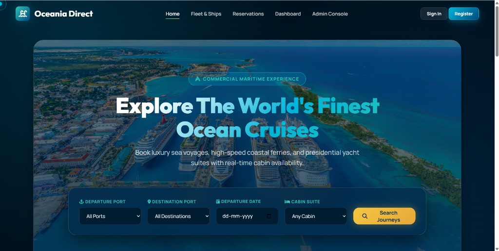
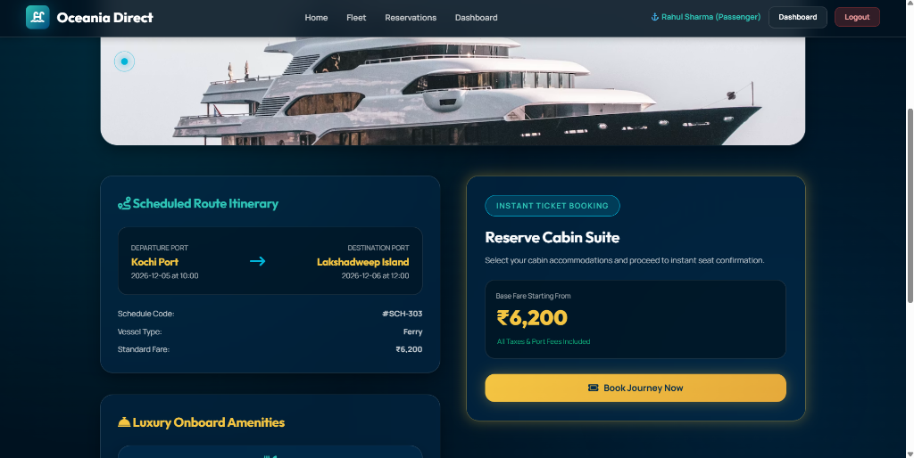
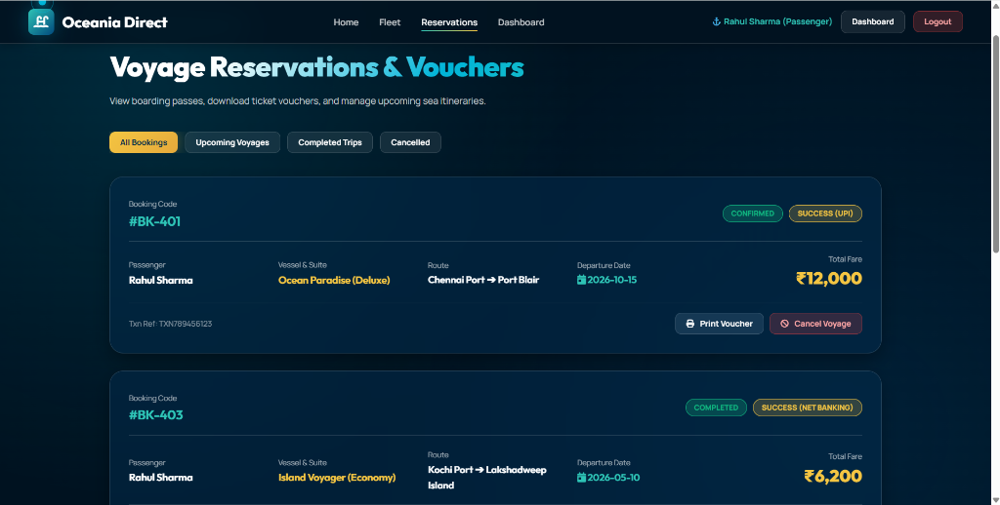
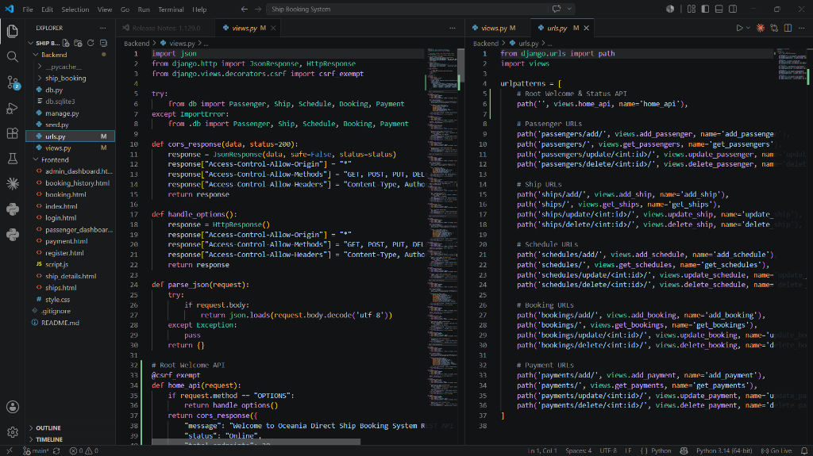
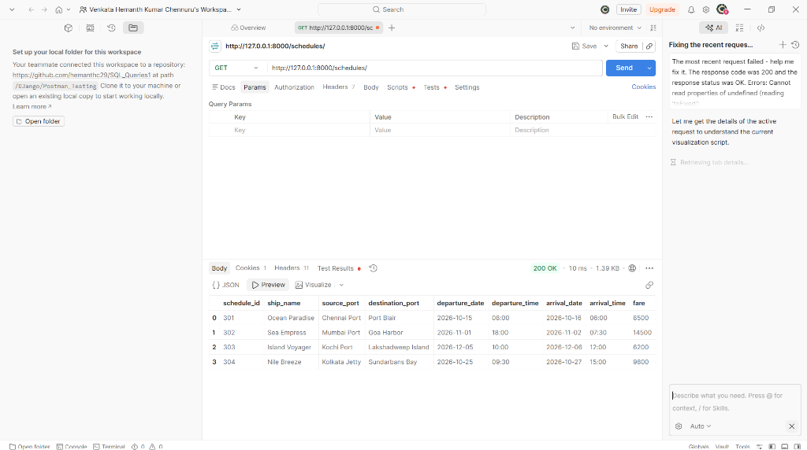

# 🌊 Oceania Direct - Ship Booking System

A full-stack, enterprise-grade Maritime Transportation & Cruise Booking Platform engineered with a **Django REST API Backend (Function-Based Views)** and a **Multi-Theme HTML5/CSS3/ES6 JavaScript Frontend**.

[](https://github.com/hemanthc29/Ship-Booking-System)
[](https://www.djangoproject.com/)
[](https://www.python.org/)
[](https://www.sqlite.org/)
[](LICENSE)

---

## 🌟 Application Screenshots & Visual Tour

### 1. Home Page Hero & Floating Search Widget


### 2. Ship Specifications & Route Itinerary


### 3. Voyage Reservations & Boarding Pass Vouchers


### 4. VS Code Workspace & Package Architecture


### 5. Postman REST API Testing & JSON Verification


---

## 🎨 Multi-Theme Luxury Engine

Oceania Direct features a dynamic 1-click **Theme Switcher Pill Widget** embedded into the navigation header across all 10 frontend pages:

- 🌙 **Ocean Deep Night** *(Default)*: Deep Navy (`#011627`), Cyber Cyan (`#00F2FE`), Electric Blue (`#4FACFE`).
- 🌅 **Golden Sunset Horizon**: Imperial Gold (`#FFB703`), Rose Gold (`#FF758C`), Sunset Coral (`#FF7B00`), Midnight Violet (`#10002B`).
- 🏝️ **Emerald Caribbean**: Mint Emerald (`#00F5D4`), Tropical Cyan (`#00BBF9`), Abyssal Green (`#00281B`).
- 👑 **Royal Cyber Sapphire**: Royal Indigo (`#0F0C29`), Neon Violet (`#7B2CBF`), Sapphire Blue (`#24243E`).

---

## 📁 Repository Package & Directory Structure

```
ShipBookingSystem/
├── docs/
│   └── screenshots/
│       ├── home_hero_search.png
│       ├── ship_details_page.png
│       ├── booking_history_vouchers.png
│       ├── vscode_backend_frontend_structure.png
│       └── postman_api_test.png
│
├── Backend/
│   ├── db.py                 # Exposes Django ORM models for all 5 modules
│   ├── views.py              # 20 Function-Based REST API endpoints with CORS support
│   ├── urls.py               # REST API URL pattern routing
│   ├── seed.py               # Database seeder pre-populating initial sample test data
│   ├── manage.py             # Django project management entry point
│   ├── db.sqlite3            # SQLite Database instance
│   └── ship_booking/         # Django core configuration package
│       ├── __init__.py
│       ├── settings.py       # Installed apps, SQLite DB, CORS setup
│       ├── urls.py           # Root URLconf importing Backend/urls.py
│       ├── wsgi.py           # WSGI entry point
│       └── models.py         # Django Model definitions
│
└── Frontend/
    ├── index.html            # Home Page: Hero Banner, Search Journeys, Destinations Map
    ├── register.html         # Passenger Registration Form (Split-screen)
    ├── login.html            # Passenger / Admin Login Form (Role Toggle)
    ├── ships.html            # Fleet Directory with Ship Category & Status filters
    ├── ship_details.html     # Vessel Specs, Photo Gallery, Onboard Amenities & Schedule
    ├── booking.html          # Step Indicator, Interactive Deck Seat Chooser & Fare Calculator
    ├── payment.html          # 3D Card Flip Checkout & Printable Boarding Pass Voucher
    ├── booking_history.html  # Passage Reservations Timeline with Cancellation
    ├── passenger_dashboard.html # SVG Monthly Expenditure Chart, Stat Tiles & Profile Editor
    ├── admin_dashboard.html  # Executive Ocean Admin Console, SVG Revenue Graph & CSV Exporter
    ├── style.css             # Multi-Theme Stylesheet & Glassmorphism design tokens
    └── script.js             # Theme switcher, particle canvas & REST API fetch handlers
```

---

## 💻 Frontend Pages Summary

| Page | File | Description |
| :--- | :--- | :--- |
| **Home Page** | `index.html` | Fullscreen hero, floating search widget, featured cruise vessels, interactive world map, seasonal packages. |
| **Passenger Registration** | `register.html` | Split-screen registration form for passenger onboarding. |
| **Login Page** | `login.html` | Split-screen login form with role switcher (Passenger / Admin). |
| **Fleet Directory** | `ships.html` | Filterable catalog by vessel category, capacity, operator, and operating status. |
| **Ship Details** | `ship_details.html` | High-res gallery, route itinerary breakdown, deck plan, and luxury amenities grid. |
| **Cabin Booking** | `booking.html` | Multi-step reservation flow, interactive berth chooser, and live fare calculation. |
| **Payment Checkout** | `payment.html` | 3D payment card flip simulation, gateway selection, and printable ticket voucher modal. |
| **Booking History** | `booking_history.html` | Categorized view of Upcoming, Completed, and Cancelled trips with voucher printing. |
| **Passenger Dashboard** | `passenger_dashboard.html` | Real-time analytics tiles, SVG travel expenditure bar chart, and profile credentials editor. |
| **Admin Console** | `admin_dashboard.html` | Sidebar executive dashboard, real-time KPI tiles, SVG revenue analytics graph, CSV exporter, and CRUD modals for all 5 modules. |

---

## ⚡ Backend REST API Specifications (20 APIs)

### Root API Endpoint
- **`GET /`**: Returns JSON welcome message, system online status, and complete list of endpoint paths.

### Module 1 – Passenger Management
- **`POST /passengers/add/`**: Register a new passenger.
- **`GET /passengers/`**: Fetch all registered passengers.
- **`PUT /passengers/update/<id>/`**: Update passenger profile by ID.
- **`DELETE /passengers/delete/<id>/`**: Remove passenger record by ID.

### Module 2 – Ship Management
- **`POST /ships/add/`**: Register a new ship vessel in fleet.
- **`GET /ships/`**: Fetch all fleet vessels.
- **`PUT /ships/update/<id>/`**: Update ship specifications or status.
- **`DELETE /ships/delete/<id>/`**: Remove ship vessel from fleet by ID.

### Module 3 – Route & Schedule Management
- **`POST /schedules/add/`**: Create a new route schedule.
- **`GET /schedules/`**: Fetch all route schedules.
- **`PUT /schedules/update/<id>/`**: Update departure/arrival ports, dates, times, or fares.
- **`DELETE /schedules/delete/<id>/`**: Remove route schedule by ID.

### Module 4 – Cabin/Ticket Booking Management
- **`POST /bookings/add/`**: Reserve cabin ticket.
- **`GET /bookings/`**: Fetch all ticket bookings.
- **`PUT /bookings/update/<id>/`**: Update booking status (Confirmed, Waiting, Cancelled, Completed).
- **`DELETE /bookings/delete/<id>/`**: Delete booking record by ID.

### Module 5 – Payment Management
- **`POST /payments/add/`**: Record booking payment transaction.
- **`GET /payments/`**: Fetch all payment receipts.
- **`PUT /payments/update/<id>/`**: Update payment transaction details or status.
- **`DELETE /payments/delete/<id>/`**: Delete payment transaction record by ID.

---

## 📊 Sample Test Dataset

```json
// Passenger Sample
{
  "passenger_id": 101,
  "full_name": "Rahul Sharma",
  "email": "rahul@gmail.com",
  "phone": "9876543210",
  "nationality": "Indian",
  "passport_number": "N1234567",
  "password": "rahul123"
}

// Ship Sample
{
  "ship_id": 201,
  "ship_name": "Ocean Paradise",
  "ship_type": "Cruise Ship",
  "capacity": 2000,
  "operator_name": "Royal Cruises",
  "status": "Active"
}

// Schedule Sample
{
  "schedule_id": 301,
  "ship_name": "Ocean Paradise",
  "source_port": "Chennai Port",
  "destination_port": "Port Blair",
  "departure_date": "2026-10-15",
  "departure_time": "08:00",
  "arrival_date": "2026-10-16",
  "arrival_time": "06:00",
  "fare": 8500.0
}

// Booking Sample
{
  "booking_id": 401,
  "passenger_name": "Rahul Sharma",
  "ship_name": "Ocean Paradise",
  "cabin_type": "Deluxe",
  "journey_date": "2026-10-15",
  "source_port": "Chennai Port",
  "destination_port": "Port Blair",
  "total_amount": 12000.0,
  "booking_status": "Confirmed"
}

// Payment Sample
{
  "payment_id": 501,
  "booking_id": 401,
  "passenger_name": "Rahul Sharma",
  "amount": 12000.0,
  "payment_method": "UPI",
  "payment_status": "Success",
  "transaction_id": "TXN789456123",
  "payment_date": "2026-09-20"
}
```

---

## 🚀 Quick Setup & Execution Guide

### 1. Clone Repository
```bash
git clone https://github.com/hemanthc29/Ship-Booking-System.git
cd Ship-Booking-System
```

### 2. Start Backend API Server
```bash
cd Backend
python manage.py makemigrations ship_booking
python manage.py migrate
python seed.py
python manage.py runserver 8000
```

### 3. Start Frontend Server
In a new terminal window:
```bash
cd Frontend
python -m http.server 5500
```

Open `http://127.0.0.1:5500` in any web browser to view the application.

---

## 📄 License
This project is released under the MIT License.
